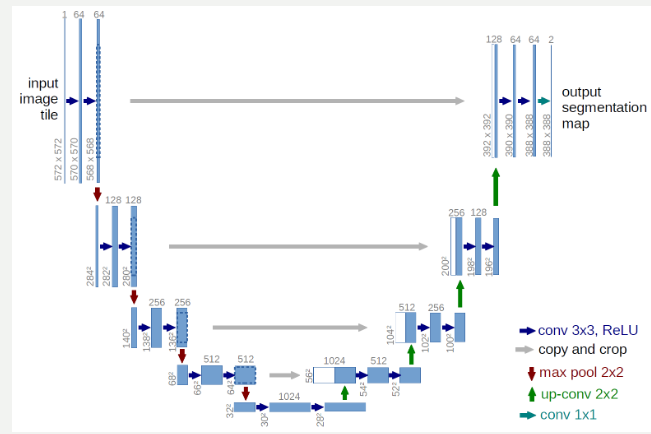
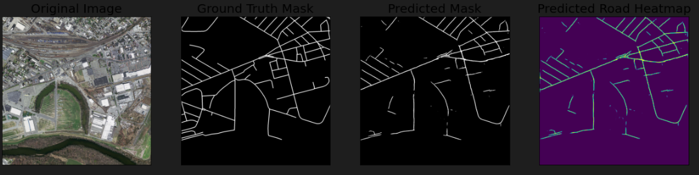
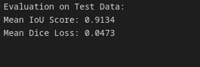
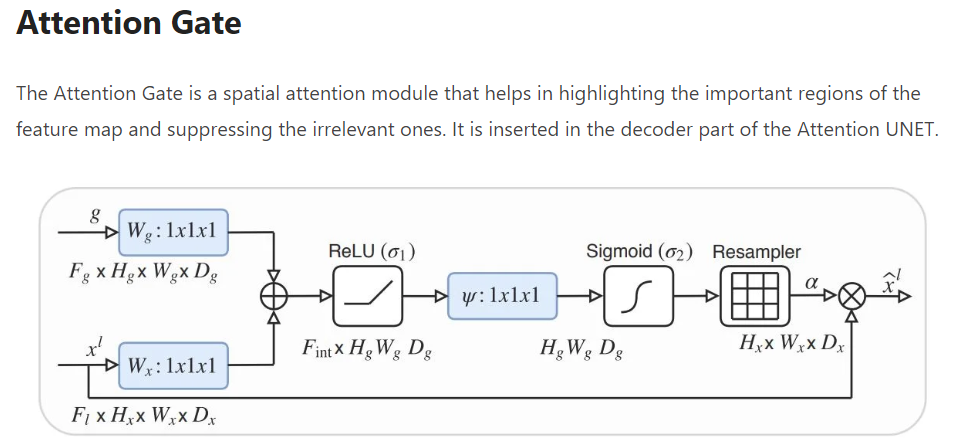

<h1>Segmentation for Ms roads</h1>
<h2>Matireals an documentations</h2>
<a href="https://lmb.informatik.uni-freiburg.de/people/ronneber/u-net/">about Unet</a> 
<a href="">Model Unet</a> 
<h2>From code/about code</h2>
<h3>Unet model</h3>

<h2>Results of programm</h2>
<h3>Prediction for model</h3>

And the final result of segmentation is
 

<h1>Road segmentation project</h1>
<h2>Crop in my code</h2>

In my program I use <a href="https://pytorch.org/vision/stable/generated/torchvision.transforms.RandomCrop.html">random crop</a> in augamentation. That's not thr same with simple crop. That version able to help our model get more information from any parrt of image <a href = "https://blog.roboflow.com/why-and-how-to-implement-random-crop-data-augmentation/">Example</a>

In <a href="https://habr.com/ru/companies/io/articles/259997/">that</a> web page we are able to see another example of corps

<h2>Unet's decoder</h2>

Some information about, how does it works 

Information about attention in Unet decoder block <a href = "https://idiotdeveloper.com/attention-unet-in-pytorch/">About attention</a> and <a href ="https://github.com/qubvel/segmentation_models.pytorch/blob/master/segmentation_models_pytorch/decoders/unet/decoder.py">Attention in the unet's decoder</a>

